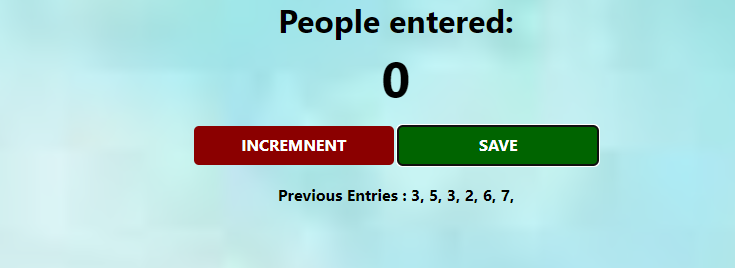

About:
This is a counter, it increments by 1 as you click on increment, and it adds it to the list of previous entries when you click on Save. When you click on save it resets the counter to 0 every time.

Concepts Learnt in this Project:

1. Script Tag
2. Variables
3. Numbers
4. Strings
5. console.log()
6. functions
7. The DOM
8. getElementById()
9. innerText
10. textContent